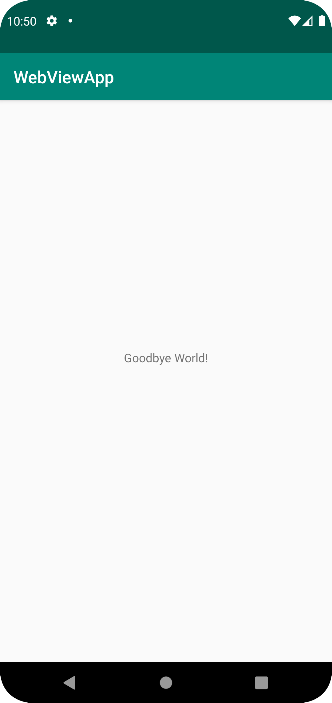

# Rapport
Först så skappades ett guthub account på deras hemsida, när den blev skapad så ’Forkades’ och ’cloned’ filen med ’Hello world’ koden, efter det så skapades en API nyckel på github som kopplades till android studio.

Från denna punkt så letades koden med ’hello world’ i sig, när den hittades så ändrades strängen med texten till ’@string/NEWTHINGSUWU’ och en ny string’<string name="NEWTHINGSUWU">Goodbye world!</string>
'. Efter det så commit and pushades koden till github


```
<TextView
        android:layout_width="wrap_content"
        android:layout_height="wrap_content"
        android:text="@string/NEWTHINGSUWU"
        app:layout_constraintBottom_toBottomOf="parent"
        app:layout_constraintLeft_toLeftOf="parent"
        app:layout_constraintRight_toRightOf="parent"
        app:layout_constraintTop_toTopOf="parent" />

</androidx.constraintlayout.widget.ConstraintLayout>

<resources>
    <string name="app_name">WebViewApp</string>
    <string name="action_external_web">External Web Page</string>
    <string name="action_internal_web">Internal Web Page</string>
    <string name="NEWTHINGSUWU">Goodbye world!</string>
</resources>
```




